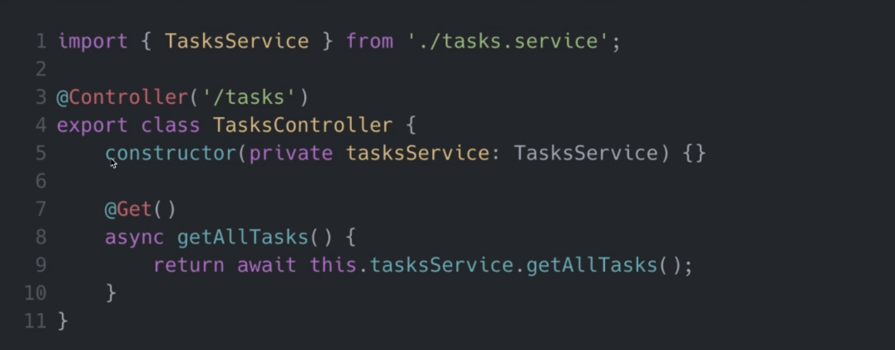

## NestJS Modules
-  Each application has at least one module and that is the root module and that is the starting point of the application.
- Modules are an effective way to organize components by a closely related set of capabilities (e.g. per feature)
-  It is a good practice to have a folder per module
- Modules are singletons, therefore a module can be imported by multiple other modules
- A module is defined by annotating a class with the module decorator: @Module
- The decorator @Module provides metada that NEST uses to organize the application structure; the properties that we can provide to the module decorator are: PROVIDERS: array of providers to be available within the module via dependency injection, CONTROLLERS: array of controllers to be instantiated within the module, EXPORTS: array of providers to export to other modules, IMPORTS: list of modules required by this currently module.

## NestJS Controllers
- They are responsible for handling incoming requests and returning responses to the client
- They are bound to a specific path: e.g. "/tasks"
- They contain handlers, which handle endpoints and request methods (GET, POST, DELETE, PUT)
- They can take advantage of dependency injection to consume providers within the same module
- Controllers are defined by decorating a class with the controller decorator @Controller
- The decorator accepts a string, which is the path to be handled by the controller. e.g. @Controller("/tasks")

### How do you define a handler in a controller?
- Handlers are simple methods within the controller class that are decorated with decorator such as: @Get, @Post, @Delete

## NestJS Providers
- They can be injected into constructors if decorated as an injectable via dependency injection
- To make something an injectable, you need to decorate it with an injectable decorator @Injectable
- They must be provided to a module for them to be usable
- They can be exported from a module and then they can be available to other modules that import that module

## NestJS Services
- Services are implemented using providers. NOT ALL PROVIDERS ARE SERVICES
- Services are a common concept within software development are not exclusive to NESTJS, JavaScript or Backend development.
- Services can be implemented as singletons, which is a design pattern when wrapped with the injectable decorator @Injectable(), and then it provided to a module. That means that the same instance will be shared across the application, acting as a single source.
- Most of our heavy business logic will reside in a service for example: a service will be called from a controller usually to validate data, create an item in the database, and maybe even return a response that is complicated and needs to be calculated.

## Dependency Injection in NESTJS
- Any component within the NESTJS ecosystem can inject a provider that is decorated with the @Injectable() decorator
- We define the dependecies in the constructor of the class
- Nestjs will take care of all of the injection for us and it will be available as a class property 

## Data Transfer Object (DTO)
- It is an object that is used to encapsulate data and send it from one subsystem of an application to another.
- It is an object that defines how the data will be sent over the network.
- DTO do not have any behavior except for storage retrieval, serialization and deserialization of its own data.
- It can be useful for data validation
- It defines the shape of data for specific case, for e.g. Creating task

## CLasses vs Interfaces for DTOs
- DTO can be defined as classes or interfaces, the recommended approach is to use classes
- Classes are the way to go for DTOs
- Data Transfer Objects are not mandatory, you can still develop application without using DTO

## Nestjs Pipes
- Pipes operate on the arguments to be processed by the root handler just before the handler is called.
- Pipes can perform data transformation or data validation
- Pipes can return data - either original or modified - which will be passed on to the route handler.
- Pipes can throw exceptions. Exceptions thrown will be handled by Nestjs and parsed into an error response.
- Pipes validates the compatibility of an entire object against a class wich goes well with DTO, if any property cannot be mapped properly, validation will fail
- Handler level pipes: are defined at handler level and are defined via decorator @UsePipes() will process all parameters for incoming requests
- Parameter level pipes: are defined at parameter level, only specific parameter for which the pipe has been specified will be processed 
- Global pipes are defined at the application level and will be applied to incoming requests regardles
- Pipes are classes annotated with the @Injectable() decorator

## ORM (Object Relational Mapping)
- Is a technique that lets you query and manipulate data from a database, using an object oriented paradigm.
- Is a ORM library that can run in Nodejs and be used with typescript
- There are many ORM libraries
- Written the data model in one place - easier to maintain, less repetition
- Lots of things done automatically - database handling, data types, relations, stc.
- No need to write SQL sintaxis
- Database abstraction - you can chance the database type whenever you wish

## Schema Validation for Configuration values
- yarn add @hapi/joi
- 

## Links Útiles
- Generar passwords seguros: https://www.passwordsgenerator.com/